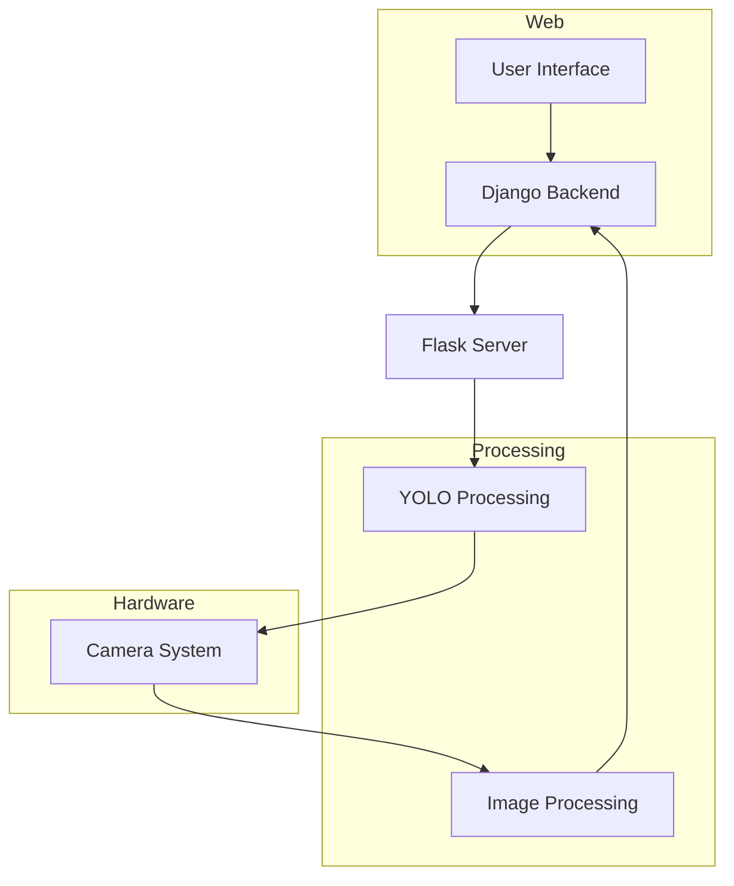
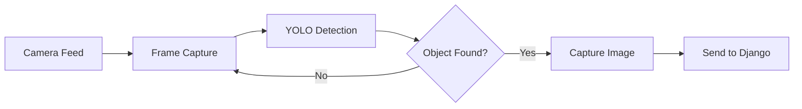
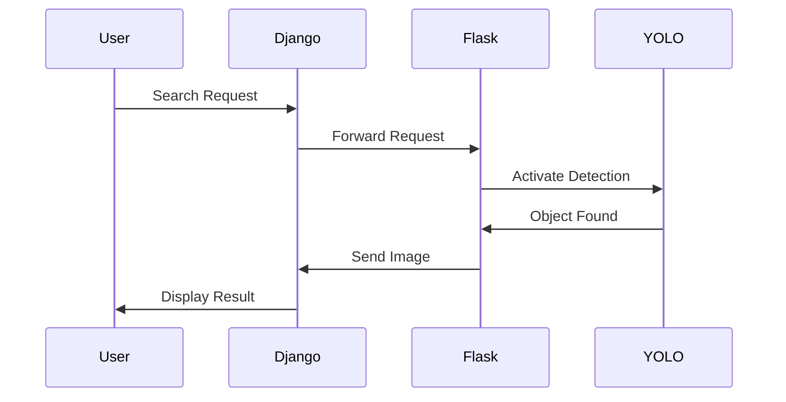
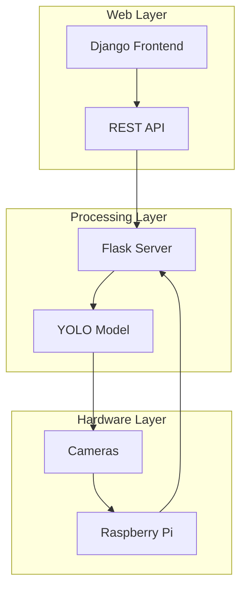
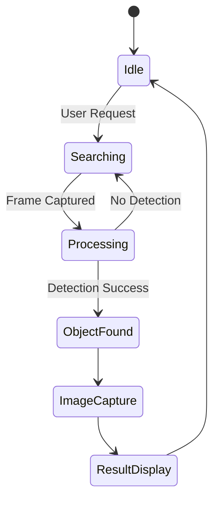
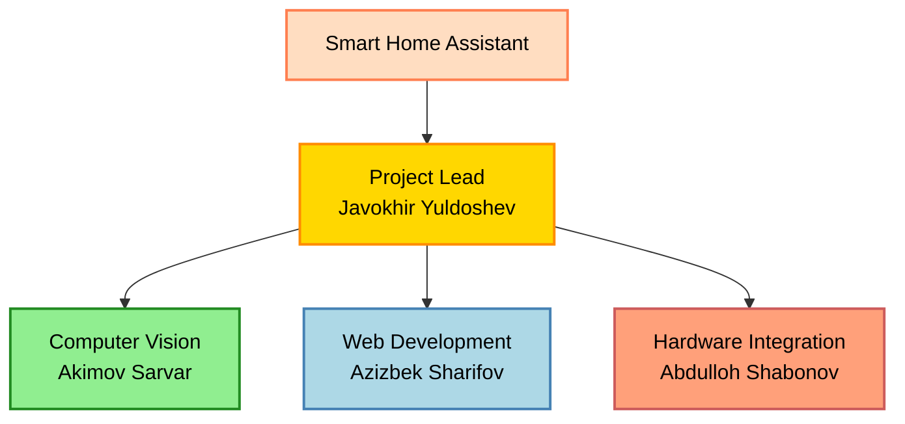

# Smart Home Assistant

An intelligent object detection system that helps locate items in your home using computer vision and Django/Flask integration.

## 🎥 Demo video

Video demonstration of the project 👉 **[video link click to see](https://drive.google.com/file/d/1okLPC6asEOXA9_uM1gL_0CQZOY_8wBoK/view)**  


## Visualisation

### Homepage


### Object selection page


### Result Page


### Image Not Found Page


## System Architecture



## How It Works

### Object Detection Pipeline



### Django-Flask Communication



### System Implementation



## API Documentation

### Flask Endpoints

```python
POST /search_object
{
    "item_name": "string",  // Object to search for
    "threshold": float,     // Detection confidence threshold
}
```

### Django Endpoints

```python
POST /receive_picture
{
    "image": file,         // Captured image
    "camera_index": int,   // Source camera ID
    "location": string     // Detection location
}
```

## Detection Process



## Project Team


