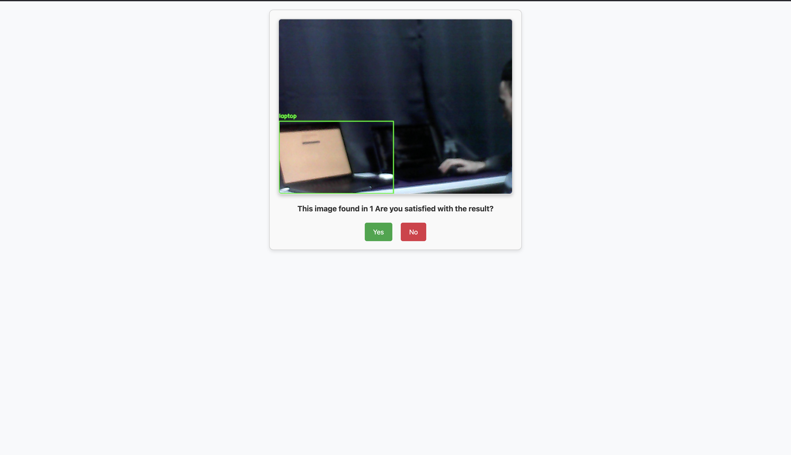

# Smart Home Assistant

An intelligent object detection system that helps locate items in your home using computer vision and Django/Flask integration.

## Visualisation

### Homepage


### Object selection page


### Result Page



### Image Not Found Page


## System Architecture


## How It Works

### Object Detection Pipeline


### Django-Flask Communication


### System Implementation


## API Documentation

### Flask Endpoints

```python
POST /search_object
{
    "item_name": "string",  // Object to search for
    "threshold": float,     // Detection confidence threshold
}
```

### Django Endpoints

```python
POST /receive_picture
{
    "image": file,         // Captured image
    "camera_index": int,   // Source camera ID
    "location": string     // Detection location
}
```

## Detection Process


## Project Team

```mermaid
organizationChart
    CEO[Smart Home Assistant]
    B[Project Lead]
    C[Computer Vision]
    D[Web Development]
    E[Hardware Integration]

    CEO --> B
    B --> C
    B --> D
    B --> E

    B[Project Lead: Javokhir Yuldoshev]
    C[Computer Vision: Akimov Sarvar]
    D[Web Development: Azizbek Sharifov]
    E[Hardware Integration: Abdulloh Shabonov]
```
